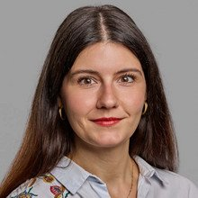

::: {.team-page}

### The workshop

**This workshop is a collaboration between the [Provenance Lab](https://www.leuphana.de/en/institutes/ipk/provenance-lab.html) and the [Getty Provenance Index](https://www.getty.edu/research/tools/provenance/).**

After decades working as provenance and art history researchers, we have witnessed the field changing and evolving in many different ways. We believe that the intersection between computational techniques and a more data-driven approach can not only reveal patterns, structures, and dynamics that were hard to uncover through close reading, but also lead us to new research questions that were previously impossible to answer or to know. We call it computational provenance, which is provenance research using statistics, network analysis, optical character recognition, large language models, and natural language processing for research purposes.

Our goal with this workshop is to provide tools to researchers and practitioners and to introduce them to methodologies that can inspire them to create new policies and to use different methods or techniques within their institutions or in their personal research. We believe that to continue working toward computational provenance we all need to understand all the possibilities and how the field can change. We believe that interdisciplinary work with computer scientists or digital humanities specialists is extremely valuable, but for fair and equal collaboration we need a good understanding of what can be done and how. That is why our workshop aims to give participants a first encounter with theories, methods, and tools, to empower them.

---

### Organizers and Instructors

<!-- To add a photo: save it in images/ with the file name used below (e.g. images/Lynn.jpeg).
     Until a photo exists, the person's initials are shown instead. -->

  

  <h2>Bárbara Romero Ferrón</h2>
  
Provenance Lab, Leuphana University of Lüneburg

  

  <h2>Lynn Rother</h2>
  
Provenance Lab, Leuphana University of Lüneburg

  

  <h2>Giulia Taurino</h2>
  
Getty Provenance Index, Getty Research Institute

  

  <h2>Sandra van Ginhoven</h2>
  
Getty Provenance Index, Getty Research Institute

:::
